# 开发者账号申请

目前开发者账号仅对公司用户开放注册。您如果有兴趣，请前往我们的开发平台网站 [developers.altizure.cn](https://developers.altizure.cn) 或 [developers.altizure.com](https://developers.altizure.com) 申请。

跟随以下教程，您就可以顺利完成开发者账号的申请。

## 1. Altizure 账号
#### 1.1 申请 Altizure 账号
申请开发者账号需要您先拥有 Altizure 账号， Altizure 账号提供了精准快速的自动建模功能，即使是免费版 Altizure 账号也一定会让您爱不释手。只需花费几分钟，我们有信心彻底颠覆您对三维的理解。

如果您已经拥有了 Altizure 账号，请直接看本章第二部分 `2. Altizure 开发者账号`。

登陆或注册您的 Altizure 账号。

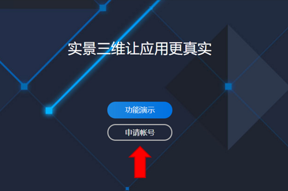

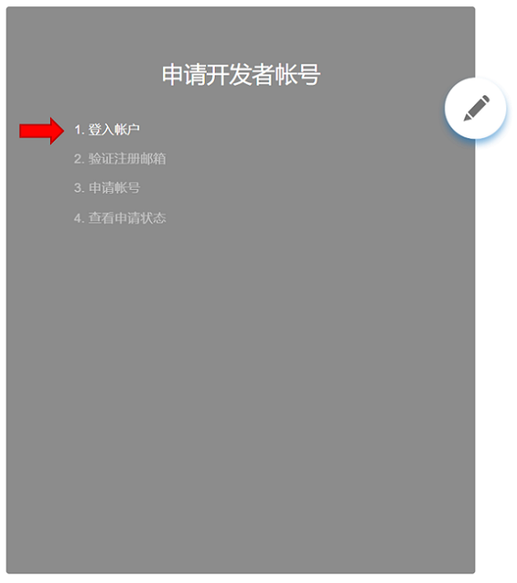

如果您还没有注册 Altizure 账号，赶快点击 “建立新账号” ，加入 Altizure 大家庭，享受实景三维带来的乐趣。

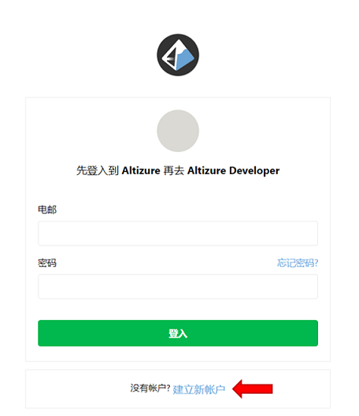

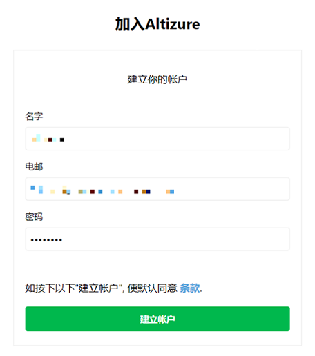

当然，您注册成功后还要授权给Altizure Developer，才可以进行下一步的操作。

#### 1.2 验证注册邮箱
为了方便我们给您提供更加强大的技术支持，一个有效的邮箱也是不可或缺的。

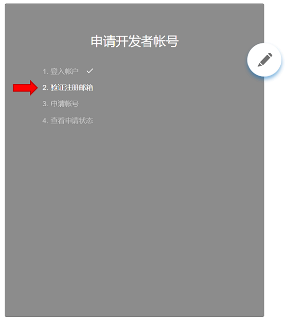

一封验证邮件将发送到您注册时所使用的邮箱中。

小提示：如果没有收到验证邮件，请检查一下您的垃圾箱、已删除或者广告邮件。

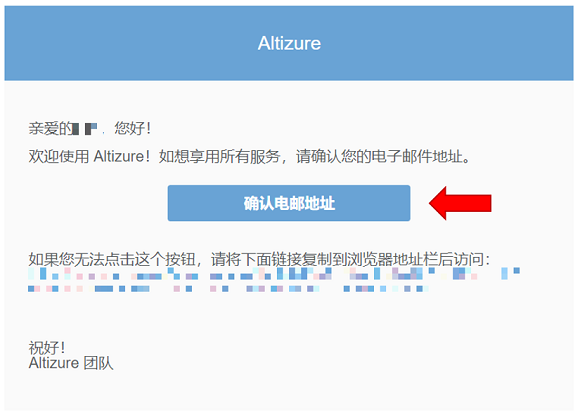

看到这个界面，说明您的验证邮箱已经通过啦。

## 2. Altizure 开发者账号
#### 2.1 申请开发者账号

目前开发者账号只针对企业用户，如果您想在 Altizure 的基础上开发更加个性化的功能，欢迎与我们的客服进行联系[developers@altizure.com](mailto:developers@altizure.com)

在这里填入您的公司信息，以加快开发者账号的审核速度。

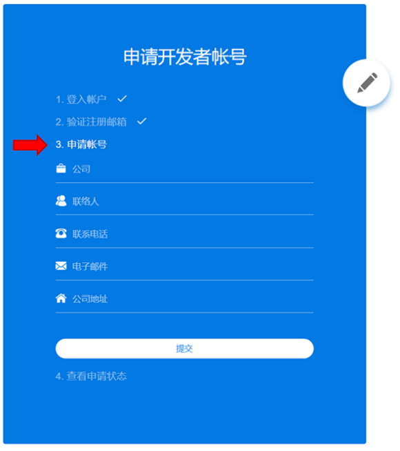

#### 2.2 等待审核通过

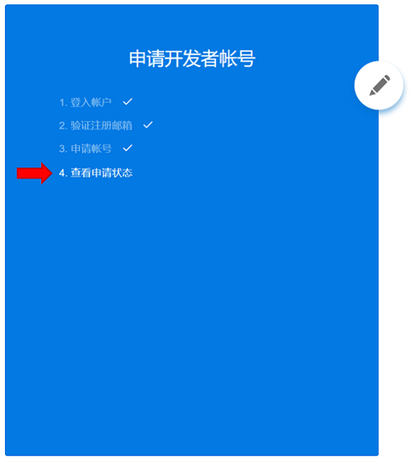

提交信息后，我们将在5个工作日内回复您，并欢迎您随时与客服联系以获得最新审核进度。

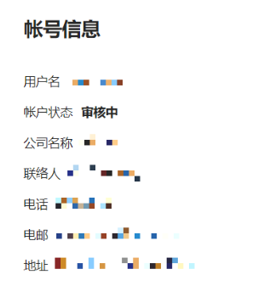

当您的账号状态变为“通过审核”时，说明您已获得了开发者的所有权限，您可以添加应用并获得开发所必须的“APP Key”，在此之后，您就可以在 Altizure 的世界中尽情发挥想象力了。

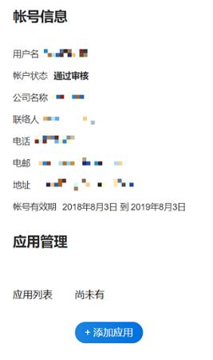

在这里，您可以创建您的 APP 并得到您的 APP Key。

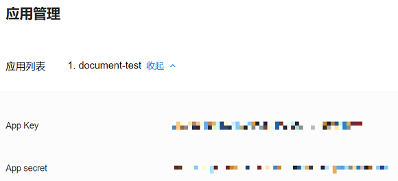

欢迎随时与我们的客服进行联系：[developers@altizure.com](mailto:developers@altizure.com)

关于最新的开发者信息，请关注我们的社交媒体和官方博客：

* 微信公众号：altizure_info
* 中文官方博客：[blog.altizure.cn](https://blog.altizure.cn)
* Altizure 开发平台: [developers.altizure.cn](https://developers.altizure.cn)

**开者账号权限**
• 在开发者账号底下创建应用的权限。
• 访问 Altizure 开放平台所有开发技术资源的权限。
• ⼯作日邮件技术⽀持。
• 全年4次的电话会议⽀持。每次会议时⻓ 1 ⼩时。需要更多的电话会议⽀持可以购买更多的服务。（RMB 5000元/4次）
• 每年参加⼀次官⽅组织的开发者培训。

**开发⼈员需具备的基本能⼒**
• 熟悉开发网站中的所有基本概念，GraphQL API 和 Javascript SDK 的作用。
• 熟悉 https://altizure.github.io/sdk.examples/examples.sdk.html 里面每个范例所展示的功能，以及如何将这些功能组合成更复杂的功能。

**账号申请所需资料**
•	Altizure开发者账户：可将某一Altizure账号升级为开发者账号，或直接在Altizure[开发平台](https://developers.altizure.cn/)上，申请成为Altizure Developer
•	公司营业执照
•	Altizure开发者账户的联系人名字、电话和职位
•	需要申请使用开发平台的应用名字。这是第⼀个初始应用，账号申请成功后，可以任意申请更多的应用
  •	网页端：需要提供网址
  •	⼿机端：需要应⽤的ID，如 Apple 应用 ID 和 Android 的应用ID
  •	应用功能简述
  

---

该文档最后修改于 {{ file.mtime }}
