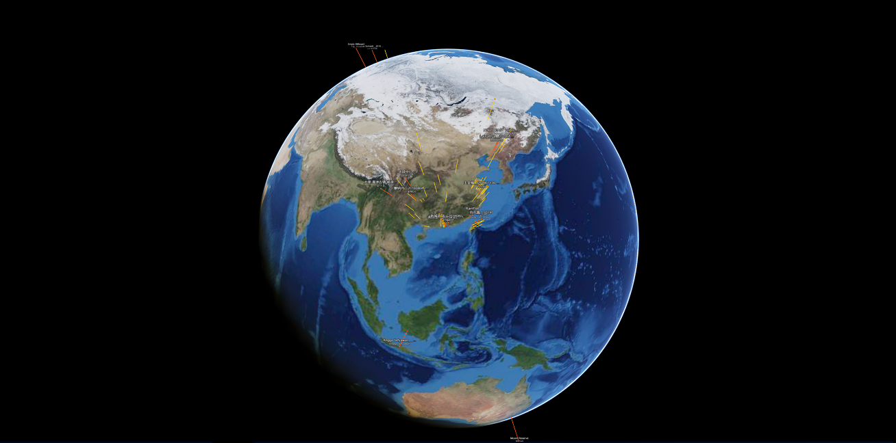

# 3D SDK 教程 1.快速开始


## 1. 快速开始指南
想把地球显示在屏幕上，总共分几步？

三步。

#### 第一步：引用 SDK

在网页的 head 部分，引用我们的 SDK。

```html
<!-- 设置编码，确保 utf8 字符的正确显示 -->
<meta charset="utf-8">
<!-- 设置 viewport，确保移动端的正确渲染 -->
<meta name="viewport" content="width=device-width, initial-scale=1.0, user-scalable=no">
<!-- 引用sdk -->
<script type="text/javascript" src="https://beta.altizure.com/sdk"></script>
```

我们提供四个版本的 SDK 引用链接供您选择：

* 最新版：`<script type="text/javascript" src="https://beta.altizure.com/sdk"></script>`
* 稳定版：`<script type="text/javascript" src="https://www.altizure.com/sdk"></script>`
* 中国最新版：`<script type="text/javascript" src="https://beta.altizure.cn/sdk"></script>`
* 中国稳定版：`<script type="text/javascript" src="https://www.altizure.cn/sdk"></script>`

#### 第二步：创建三维显示容器

三维数据的下载和渲染会由我们的 SDK 完全接管，用户只需要创建一个 `div` 指定用于渲染的容器的位置和大小。

```html
<body>
  <div id="page-content"></div>
</body>
```

#### 第三步：创建三维引擎对象

我们的三维引擎是以最新的 Altizure 地球的引擎作为基础，新建对象时需要把它附着在一个作为显示容器的 `div` 里。

```js
  // 创建一个参数配置对象
  let options = {
    altizureApi:{
      // 填入您的 app key
      key: 'your-app-key'
    }
  }

  // 创建地球渲染引擎对象，附着在 page-content 这个 div 上
  let sandbox = new altizure.Sandbox('page-content', options)
```

其中 `'page-content'` 是第二步中创建三维显示容器的 `div` 的 id。`options` 用于配置新建的引擎对象，更多参数可以参考下面的范例和详细文档。

## 2. 小结

所有代码组合起来就是：

```html
<html lang="en">
<head>
  <meta charset="utf-8">
  <meta name="viewport" content="width=device-width, initial-scale=1.0, user-scalable=no">
  <script type="text/javascript" src="https://beta.altizure.com/sdk"></script>
</head>
<body>
  <div id="page-content"></div>
  <script>
    let options = {
      altizureApi:{
        // 填入您的 app key
        key: 'your-app-key'
      }
    }

    let sandbox = new altizure.Sandbox('page-content', options)
  </script>
</body>
</html>
```

把这段代码保存为一个 html 文件并放在一个文件夹如 `<path>/altizure-sdk-test/earth.html` 中，然后在控制台中键入：

```bash
cd <path>/altizure-sdk-test/
python -m SimpleHTTPServer
```

再通过浏览器访问 `http://127.0.0.1:8000/earth.html` 就可以加载这个 Altizure 地球了。

您也可以访问[演示页面](https://altizure.github.io/sdk.examples/1-1-altizure-earth/index.html)观看这段代码的效果。



只要三步，我们便创建出了一个可以加载全球实景三维模型的视图。惊不惊喜？激不激动？

相信您已经被 Altizure Javascript 3D SDK 多彩有趣的内容深深吸引了，接下来我们将直接通过范例代码来学习 SDK 的丰富功能。

## 3. 了解更多

* [Altizure SDK 文档](https://docs.altizure.com/zh-hans/docs/user_docs/web/)
* [演示范例](https://developers.altizure.com/demo)

—

该文档最后修改于 {{ file.mtime }}
