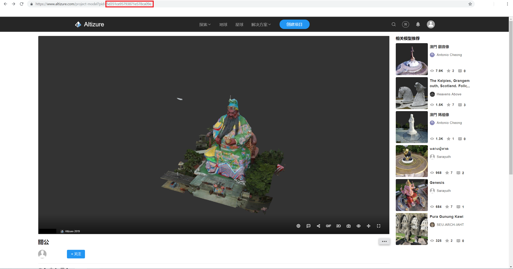
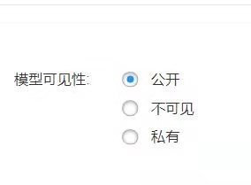
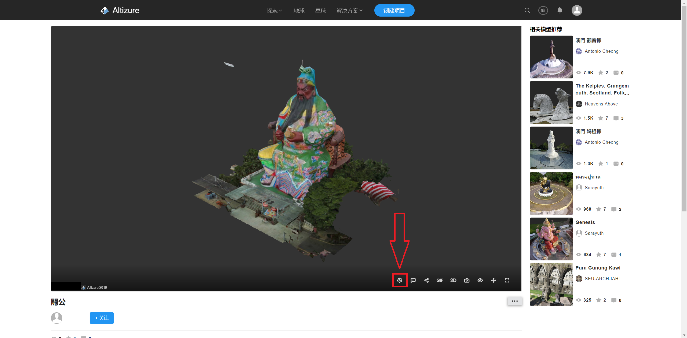
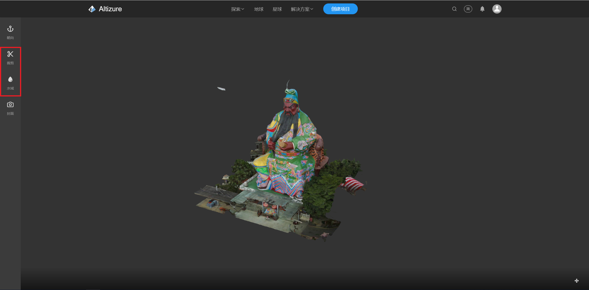

# 3D SDK 教程 2.如何加载 Altizure 项目


## 1. 获得pid

```js
  sandbox.add('AltizureProjectMarker', {pid: '5849104597b73e0b090c01e8'})
```
如范例 2-1 add project 所示，加载一个位于 Altizure 主站上的项目，需要在 SDK 中输入相应项目的 pid 。

在Altizure主站打开您所想要加载的项目，在地址栏内就可以找到这个项目的pid，如下图所示。



当然，也要先确定模型的可见性，偷偷加载别人的私有模型肯定是不行的。



* 公开：将会在Altizure主站显示，可以被SDK访问到
* 不可见：不会在Altizure主站显示，可以被SDK访问到
* 私有：不会在Altizure主站显示，不可以被SDK访问到

此外，在相片数量足够、位置合适等条件下，正常生成的模型的大小、位置、姿态是不需要做额外调整的。如需调整，请参考Altizure SDK 文档相关内容。

非Altizure重建出的模型，比如说上传的obj模型，还是需要设置各种参数的，具体怎样调整推荐您是用我们的 Altizure 星球，里面可以进行可视化的调整。


## 2. 加载裁切和水面


如需裁剪多余的模型和添加水面效果，需要先在Altizure主站对模型进行设置。



首先点击模型中的“设置”按钮，进入模型设置页面，然后就可以设置模型的裁剪和水面效果了。



在设置完成后，在SDK中加载相关模型后导入裁切效果和水面。

```js
  marker.loadCropMask()
  marker.water.import()
```

## 3. 小结

在本教程中展示了如何使用 pid 在 SDK 中导入模型，并如何导入模型的裁切和水面效果。
完整代码如下：
```js
  sandbox.add('AltizureProjectMarker', {pid: '5993d8e65cbfaf1d4eba995d'})
  .then(function (marker) {
    m = marker
    // wait for marker initialization
    return marker.initialized
  })
  .then(function (marker) {
    // apply crop from altizure
    return marker.loadCropMask()
  })
  .then(function (marker) {
    // import water from altizure
    return marker.water.import()
  })

```

## 4. 了解更多

* [Altizure SDK 文档](https://docs.altizure.com/zh-hans/docs/user_docs/web/)
* [演示范例](https://developers.altizure.com/demo)

—

该文档最后修改于 {{ file.mtime }}
