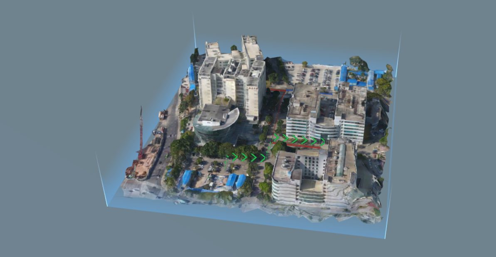
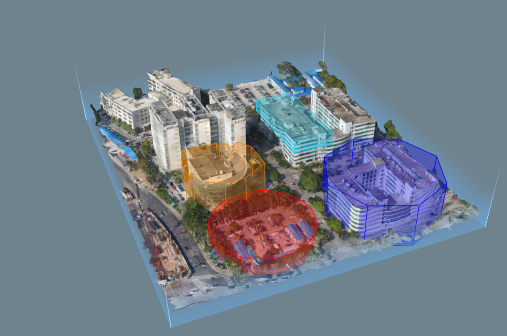

# 3D SDK 教程 3.添加、删除 Marker

Altizure SDK 为开发者提供了多种多样的 marker 来丰富您的应用，为了防止过多的内容打扰您使用的兴趣，本章节将分为小白部分和进阶部分，小白部分仅介绍如何添加最基础的 marker ，之后在进阶部分会对 marker 更加丰富的功能和更加多样的种类进行说明和列举。

众所周知，数据可以分为点、线、面，因此我们也有相对应的 marker 来帮助您实现应用。
## 1. 小白部分

#### 1.1 添加点数据 -- TagMarker

Tag Marker 是最基础的点数据的添加


```js
  let tag1 = new altizure.TagMarker({
    // icon image url
    imgUrl: '../public/assets/img/meta_description.png',
    // icon position
    position: {lng: 113.9390549031058, lat: 22.53601411862488, alt: 59.03098709697936},
    // scene
    sandbox: sandbox,
    // icon size
    scale: 1
  })
```
在这里需要设置 marker 的图标、位置、大小等。

相关部分请参考范例 2.2

#### 1.2 添加线数据 -- PolyLineMarker


```js
  let pts3 = [
    {lng:113.94004434545403, lat:22.536430666836896, alt:8.529936080552108},
    {lng:113.93989197826778, lat:22.53642506074514,  alt:8.37267703295911},
    {lng:113.93992379693061, lat:22.536772011456577, alt: 14.698098228363094},
    {lng:113.93948096227913, lat:22.536774790964845, alt: 8.07877871224377},
    {lng:113.93946847564925, lat:22.537257065188992, alt: 7.9259919311032805},
    {lng:113.93937849508251, lat: 22.537250183225215,alt: 9.203476070513277}
  ]

  let pl3 = new altizure.PolyLineMarker({
    name: 'pl3',
    sandbox: sandbox,
    points: pts3,
    color: 0x26b74f,
    fenceHeight: 10
  })
```
这里需要设置 polyline marker 的点、颜色、线的高度等。
相关代码请参考范例2.4

#### 1.3 添加面/体数据 -- PolygonMarker


```js
  let volume1 = {
    color: 0xf18100,
    opacity: 0.3,
    points: [
      {lng:113.93925941184116, lat:22.536038196392003, alt::0},
      {lng:113.93939916032888, lat:22.53604334346038, alt::0},
      {lng:113.93949169260934, lat:22.535989287779092, alt::0},
      {lng:113.93968369699786, lat:22.536004548701953, alt::0},
      {lng:113.93980670120246, lat:22.536189580024878, alt::0},
      {lng:113.93979655362506, lat:22.536343017899227, alt::0},
      {lng:113.93966951962702, lat:22.536531935218072, alt::0},
      {lng:113.93941344618156, lat:22.536525930027356, alt::0},
      {lng:113.93929820633633, lat:22.536458412171328, alt::0},
      {lng:113.93936482152544, lat:22.53637169479775, alt::0},
      {lng:113.93929172179965, lat:22.53637475960443, alt::0},
      {lng:113.9393084139167, lat:22.53630775602314, alt::0},
      {lng:113.93925819093029, lat:22.53630539546885, alt::0},
      {lng:113.93925941184116, lat:22.536038196392003, alt::0}
    ]
    top: 40, 
    bottom: 0,
  }
  let poly1 = new altizure.PolygonMarker({
    volume: volume1,
    sandbox: sandbox,
    name: 'polygon1',
  })
```
多边形需要闭合，即所用点数组的首尾两个点需要一样。

这里需要设置 polygon marker 的点、颜色、高度等。

相关代码请参考范例2.3

#### 1.4 删除 Marker

所有的 Marker 都可用 duxtruct 进行删除
```js
  marker.destruct()
```
删除后此 Makrer 将不存在并释放所有占用的资源。

#### 1.5 小结
至此，最基础的点、线、面的数据和相应 marker 如何显示和删除已经介绍完了。

建议您先完成其他教程的小白部分，之后在尝试进阶部分。


## 2. 进阶部分

#### 2.1 marker 的鼠标事件
这里所列的所有 marker 都可以相应鼠标事件。

首先要打开 marker 的 interactable
```js
  tag.interactable = true
```
然后对想要响应的鼠标事件进行定义，目前开放的鼠标事件如下。
```js
  tag.on('mouseenter', function(e) { console.log("enter") })
  tag.on('mouseleave', function(e)  { console.log("leave") })
  tag.on('mouseover', function(e) { console.log("over")})
  tag.on('click', function(e)  { console.log("click")})
  tag.on('mousedrag', function(e)  { console.log("darg")})
```
#### 2.2 更多的点状 marker
##### 2.2.1 文字标签 -- TextTagMarker
和 TagMarker 使用方法大致相同，本 marker 可以自定义显示的文字信息。
相关代码和效果请参考范例 2.6。
##### 2.2.2 自定义标签 -- CanvasTagMarker
和 TagMarker 使用方法大致相同，本 marker 可以自定义显示的信息，调整方法与 HTML 的 canvas 标签一致。
相关代码和效果请参考范例 2.9。
##### 2.2.3 光柱标签 -- LightBeamMarker
简单实用的光柱 marker。
相关代码和效果请参考范例 2.10。

#### 2.3 更多的线状 marker 
##### 2.3.1 圆柱形多段线 -- PolyCylinderLineMarker
只能调颜色和透明度的圆柱形多段线。
相关代码和效果请参考范例 2.8。
##### 2.3.2 自定义动画的圆柱形多段线 -- PolyTubeLineMarker
可以看作PolyCylinderLineMarker的升级版，可以添加动画效果。
相关代码和效果请参考范例 2.14。

#### 2.4 更多的面/体状 marker 
##### 2.4.1 正多边形 -- RegularPolygonMarker
使用方法与 PolygonMarker 大致相同，不过需要设置本多边形的中心位置、半径、边数等。
相关代码和效果请参考范例 2.3。
##### 2.4.2 圆柱 -- CylinderVolumeMarker
使用方法与 PolygonMarker 大致相同，不过需要设置本多边形的中心位置、半径等。
相关代码和效果请参考范例 2.3。
##### 2.4.3 区域 -- ZoneMarker
定制化的多边形的应用，可以方便用户在不同角度看到和本多边形有关的文字（如：“禁止进入”）。
相关代码和效果请参考范例 2.11。
##### 2.4.4 挖坑 -- DitchMarker
已包装好的 PolygonMarker ，具有类似土壤的贴图，适宜用作管线填挖、路面开挖、地基房基等的展示。
相关代码和效果请参考范例 6.3。


## 3. 小结

本教程介绍了 Altizure SDK 中经常使用的 marker ，

## 4. 了解更多

* [Altizure SDK 文档](https://docs.altizure.com/zh-hans/docs/user_docs/web/)
* [演示范例](https://developers.altizure.com/demo)

—

该文档最后修改于 {{ file.mtime }}
