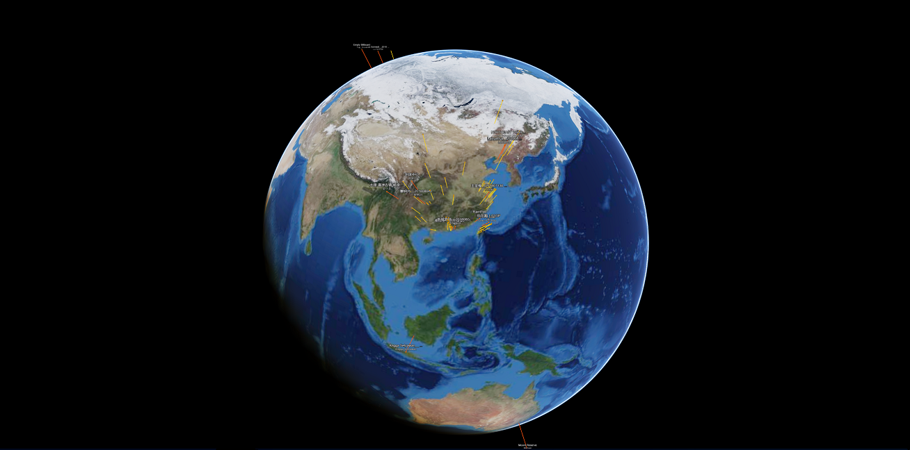

# Altizure JavaScript SDK

这是一个以 JavaScript 为开发语言的 SDK。提供了丰富的三维浏览和编辑的功能。SDK 的主要目的是：

* 简化加载和渲染海量三维数据的开发工作
* 简化各种数据源的数据在实景三维底图上的整合和高效显示
* 简化实景三维数据和行业应用的开发工作

使用 Altizure JavaScript 3D SDK 并结合 Electron 、 React Native 等混合开发的工具具有大量实用功能，而开发者只需掌握网页编程所需的 JavaScript 和 HTML 就可以轻松开发出高质量的实景三维桌面和移动应用，助力您的商业应用。

## 1. 快速开始指南
想把地球显示在屏幕上，总共分几步？

三步。

#### 第一步：引用 SDK

在网页的 head 部分，引用我们的 SDK。

```html
<!-- 设置编码，确保 utf8 字符的正确显示 -->
<meta charset="utf-8">
<!-- 设置 viewport，确保移动端的正确渲染 -->
<meta name="viewport" content="width=device-width, initial-scale=1.0, user-scalable=no">
<!-- 引用sdk -->
<script type="text/javascript" src="https://beta.altizure.com/sdk"></script>
```

我们提供四个版本的 SDK 引用链接供您选择：

* 最新版：`<script type="text/javascript" src="https://beta.altizure.com/sdk"></script>`
* 稳定版：`<script type="text/javascript" src="https://www.altizure.com/sdk"></script>`
* 中国最新版：`<script type="text/javascript" src="https://beta.altizure.cn/sdk"></script>`
* 中国稳定版：`<script type="text/javascript" src="https://www.altizure.cn/sdk"></script>`

#### 第二步：创建三维显示容器

三维数据的下载和渲染会由我们的 SDK 完全接管，用户只需要创建一个 `div` 指定用于渲染的容器的位置和大小。

```html
<body>
  <div id="page-content"></div>
</body>
```

#### 第三步：创建三维引擎对象

我们的三维引擎是以最新的 Altizure 地球的引擎作为基础，新建对象时需要把它附着在一个作为显示容器的 `div` 里。

```js
// 创建一个参数配置对象
let options = {
  altizureApi:{
    // 填入您的 app key
    key: 'your-app-key'
  }
}

// 创建地球渲染引擎对象，附着在 page-content 这个 div 上
let sandbox = new altizure.Sandbox('page-content', options)
```

其中 `'page-content'` 是第二步中创建三维显示容器的 `div` 的 id。`options` 用于配置新建的引擎对象，更多参数可以参考下面的范例和详细文档。

#### 小结

所有代码组合起来就是：

```html
<html lang="en">
<head>
  <meta charset="utf-8">
  <meta name="viewport" content="width=device-width, initial-scale=1.0, user-scalable=no">
  <script type="text/javascript" src="https://beta.altizure.com/sdk"></script>
</head>
<body>
  <div id="page-content"></div>
  <script>
    let options = {
      altizureApi:{
        // 填入您的 app key
        key: 'your-app-key'
      }
    }

    let sandbox = new altizure.Sandbox('page-content', options)
  </script>
</body>
</html>
```

把这段代码保存为一个 html 文件并放在一个文件夹如 `<path>/altizure-sdk-test/earth.html` 中，然后在控制台中键入：

```bash
cd <path>/altizure-sdk-test/
python -m SimpleHTTPServer
```

再通过浏览器访问 `http://127.0.0.1:8000/earth.html` 就可以加载这个 Altizure 地球了。

您也可以访问[演示页面](https://altizure.github.io/sdk.examples/1-1-altizure-earth/index.html)观看这段代码的效果。



只要三步，我们便创建出了一个可以加载全球实景三维模型的视图。惊不惊喜？激不激动？

相信您已经被 Altizure SDK 多彩有趣的内容深深吸引了，接下来我们将直接通过范例代码来学习 SDK 的丰富功能。

## 2. 范例

#### 2.1 概念释义

我们简单解释一下出现在范例里的元素的概念

* Sandbox \(沙盒\)： altizure.Sandbox \(沙盒\) 是整个三维应用的核心，它负责管理整个三维场景的数据和绘制。通过对沙盒进行定制和添加数据，可以定制出非常强大的三维应用。这是编写三维应用的主要入口。
* Marker \(标记\)： 包括 OBJMarker，ProjectMarker，CanvasTagMarker 等在内的所有模型和标签都可以被称作 marker，通过将具有不同功能的 marker 组合起来，可以获得具有丰富功能的应用，比如说我们可以在一个模型中添加水流、文字标签、火焰效果等。
* Camera \(相机\)： altizure.Sandbox.camera\(相机\) 即观众以什么视角来观看 marker，Camera 的坐标和方向就是屏幕中心点在 Sandbox 空间中的位置和朝向。

#### 2.2 范例列表

您可以参考 [github.com/altizure/sdk.examples](https://github.com/altizure/sdk.examples/) 的教程把这些范例代码下载下来，在本地建立服务器进行尝试。您只需要对其中的部分函数做些简单修改便可以和您现有的系统进行整合。

您也可以直接访问 [SDK demo](https://altizure.github.io/sdk.examples/examples.sdk.html) 来直接尝试各种范例的效果。

SDK中的控件和接口的使用方法在 [SDK 文档](ref://zh-hans/docs/user_docs/web/) 中有详细的解释。

对范例和使用方法有任何疑问可以在 [issue page](https://github.com/altizure/sdk.examples/issues) 中进行提问和交流。

<!--
#### 2.2 范例列表

* 2.2.1 Altizure 地球基本加载范例
    * [默认地球加载](https://altizure.github.io/sdk.examples/1-1-altizure-earth)
    * [设置地球加载开场动画](https://altizure.github.io/sdk.examples/1-2-open-animation)
    * [设置地球加载图层](https://altizure.github.io/sdk.examples/1-3-render-items)
    * [设置月球为底图](https://altizure.github.io/sdk.examples/1-4-lunar)
    * [改变背景](https://altizure.github.io/sdk.examples/1-5-background)
* 2.2.2 插入 Marker 范例
    * [插入 Altizure 项目](https://altizure.github.io/sdk.examples/2-1-add-project)
        * [设置水面](https://altizure.github.io/sdk.examples/2-1-add-project-water)
    * [插入自定义标签](https://altizure.github.io/sdk.examples/2-2-add-tag)
    * [插入多边形和体块](https://altizure.github.io/sdk.examples/2-3-add-polygon)
    * [插入折线](https://altizure.github.io/sdk.examples/2-4-add-polyline)
    * [插入 obj 模型](https://altizure.github.io/sdk.examples/2-5-add-obj-model)
    * [插入文字标签](https://altizure.github.io/sdk.examples/2-6-add-textTag)
    * [插入带标签折线](https://altizure.github.io/sdk.examples/2-7-add-label-line)
    * [插入圆柱形折线](https://altizure.github.io/sdk.examples/2-8-polycylinder)
    * [插入 canvas 标签](https://altizure.github.io/sdk.examples/2-9-add-canvasTag)
* 2.2.3 交互事件
    * [鼠标事件](https://altizure.github.io/sdk.examples/3-1-mouse-events)
    * [解绑事件](https://altizure.github.io/sdk.examples/3-2-event-off)
* 2.2.4 获取坐标
    * [获取地球表面坐标](https://altizure.github.io/sdk.examples/4-1-earth-pickpoint)
    * [获取模型表面坐标](https://altizure.github.io/sdk.examples/4-2-project-pickpoint)
    * [窗口坐标获取地球坐标](https://altizure.github.io/sdk.examples/4-3-window-to-lnglatalt)
    * [地球经纬度转换窗口坐标](https://altizure.github.io/sdk.examples/4-4-window-from-lnglatalt)
    * [读取高程](https://altizure.github.io/sdk.examples/4-5-lnglat-to-alt)
* 2.2.5 相机操作
    * [相机姿态设置](https://altizure.github.io/sdk.examples/5-1-camera-pose)
    * [相机飞行设置](https://altizure.github.io/sdk.examples/5-2-camera-fly)
    * [设置相机移动限制](https://altizure.github.io/sdk.examples/5-3-camera-range)
    * [控制相机移动](https://altizure.github.io/sdk.examples/5-4-camera-control)
    * [设置相机矩阵](https://altizure.github.io/sdk.examples/5-5-camera-mat)
* 2.2.6 其他
    * [裁剪项目](https://altizure.github.io/sdk.examples/6-1-crop-project)
    * [体积测量](https://altizure.github.io/sdk.examples/6-2-measurement-volume) -->

## 3. 常见问题

可以访问[常见问题](jssdk-faq.md)了解更多常见问题解答。[演示应用](jssdk-demo.md)页面展示了更加复杂的 Altizure JavaScript SDK 应用范例。访问[详细文档](ref://docs/user_docs/web/)了解更多细节。

## 4. 了解更多

* [ThreeJS](https://threejs.org/)
* [WebGL](https://www.khronos.org/webgl/)
* [OpenGL](https://www.opengl.org/)
* [Vulkan](https://www.khronos.org/registry/vulkan/)
*  OpenGL 坐标变换详解 [OpenGL Transformation](http://www.songho.ca/opengl/gl_transform.html)

—

该文档最后修改于 {{ file.mtime }}
