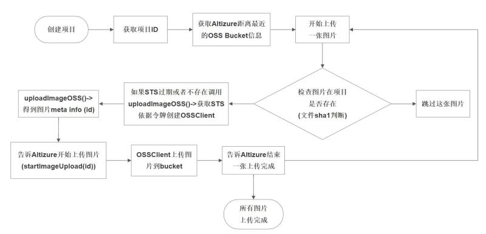

# 上传图像

## 概况

为了获得最佳的上传速度，用于三维重建的图像将直接从客户电脑传输到我们的亚马逊或者阿里云的存储空间里。
传输和存储中，您的图像将被严格保密，其他任何人都不可以读取和修改您的图像。
所以上传开始前需要开发者通过我们的 API 获取一个临时的加密 url (亚马逊 S3) 或者 STS 鉴权令牌  (阿里云 OSS)。因为在 altizure 上每个项目中不允许有同名文件，所以我们的 API 会根据您所上传文件的校验码分配一个唯一的文件名，而不是直接使用原文件的名字作为上传的名字。上传完成后便可以调用启动项目的 API，开始三维重建。

以下我们详细介绍上传的每个步骤。

## 1. 选择最近的 bucket

开发者可以通过 `GeoIPInfo.nearestBuckets` 这个查询来获取当前用户最近的 Bucket 用于上传，以达到最快的上传速度。

## 2. 计算图像校验码

为了保证图像上传的稳定性和数据的一致性。在上传每张图像前开发者必须

* 计算的图像的 **sha1sum** 校验码
* 调用 mutation `hasImage(pid, sha1sum)` 检查图像是否已经项目 `pid` 里存在。
* 如果图像存在则跳过该图像无需上传；如果图像不存在则上传图像。

## 3. 上传

#### 3.1 上传到阿里云的 OSS

在选择了最近的 OSS bucket 后，我们需要按照以下流程进行上传：

* 通过 `uploadImageOSS(pid, bucket, filename, type, sha1sum)` 获取 **STS** 令牌及其他上传所需的图像 meta info，包括上传 **图像的 id** 和 **哈希化的文件名**。STS 令牌的有效期只有 1 小时，对相关 bucket 的 `/pid` 只有写权限。如果 STS 令牌过期了，开发者必须利用同样的 mutation `uploadImageOSS(pid, bucket, filename, type, sha1sum)` 进行更新。如果令牌还未过期，开发者在上传新的图像时无需请求新的令牌，只需用同样的 STS 请求 `uploadImageOSS` 中的 `image` 项。虽然开发者可以每上传一张图像都请求新的 STS 令牌，但是由于阿里云的签发令牌的相应很慢每次都请求新的令牌会导致上传不太稳定，所以我们推荐在 STS 令牌未过期前，不要重复申请新的令牌。如果您使用[阿里云 OSS JavaScript SDK](https://github.com/ali-sdk/ali-oss) 中的 `Wrapper`，请注意在 STS 过期前不要重复创建该类型对象，只有在 STS 过期后才需要重新创建。创建过多 `Wrapper` 对象会导致 `The sockets is full` 的错误。
* 获取了 STS 令牌后和相应的 meta image info 后，调用 mutation `startImageUpload(id)` 通知服务器一张图像即将开始上传。
* 使用相应的 STS 令牌把图像上传到 OSS 的 bucket 里 `${pid}/${image.filename}` 的路径下。其中 `${image.filename}` 是上传前调用 `uploadImageOSS` 所返回的图像 meta info。
* 上传完成后调用 mutation `doneImageUpload(id)` 通知服务器，一张图像的上传完成了。

* 

#### 3.2 上传到亚马逊的 S3

**我们未能在中国大陆区提供亚马逊 S3 的节点，请中国大陆的开发者使用阿里云的 OSS 节点。**

如果最近的上传节点是在 S3，开发者可以使用 S3 上传图像。

* 在每张图像上传前，调用 mutation `uploadImageS3(pid, bucket, filename, type, checksum)` 获取一个有效期为 3 小时的加密 url 和相关的图像 meta info。
* 调用 `startImageUpload(id)` 通知服务器一张图像的上传即将开始。
* 通过标准的 HTTP PUT 命令把图像的文件上传到加密的 url 上，文件名为 `${image.filename}`。上传时需要把传输的内容标记为 `Content-type: JPEG`。相片上传后无需调用 mutation `doneImageUpload(id)`

## 4. 等待图像预处理

图像上传到 OSS 或者 S3 后，Altizure 的服务器会对图像进行验证和预处理，确保图像都是正确有效的。最终每个图像都会被标记为 `Ready` 或者 `Invalid`。如果 `Ready` 的图像数目和您想上传的图像数目一样，就可以继续调用 mutation `startReconstructionWithError(id, options)` 来开始三维重建。如果有效图像的数目不对，开发者可以通知用户重新上传图像确保图像正确，重新上传中可以利用 mutation `hasImage` 来判断图像是否已经存在服务器上来决定是否重新上传，只上传服务器上不完整或者不存在的图像。

开发者也可以不等待 Altizure 服务器对图像进行验证，在图像上传完后，便调用 mutation `preStartReconstruction(id, options)`。如果这样，服务器在验证完所有图像后，就会用已有的有效图像开始三维重建。

## 5. 范例

https://github.com/altizure/oss-upload-minimal

## 6. 了解更多

* 了解更多关于 [STS](https://www.alibabacloud.com/help/doc-detail/31953.htm?spm=a3c0i.o31952en.b99.284.7ab2aa72OYaf6D) 的信息
* 阿里云 [ OSS JavaScript SDK](https://github.com/ali-sdk/ali-oss)

---

Last modified at {{ file.mtime }}
